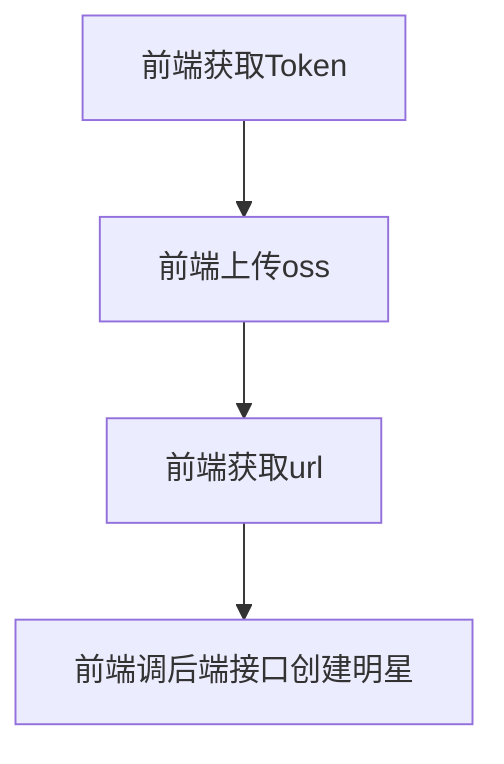

#Plan
 - [x] star搜索
 - [x] star列表
 - [x] 广告列表
 - [x] star详情
 - [x] 商品列表
 - [X] 商品详情
 - [X] 购物车
 - [ ] **支付系统**
 - [ ] **用户详情**
 - [ ] 商品上传
 - [ ] 评论区
 - [ ] 关注系统
 - [ ] 收藏系统 get done in 1.16
 - [ ] 订单状态获取
 - [ ] 电脑端验证码滑块
 - [ ] 明星详情photo方程cover image
 - [ ] create product dtm
 - [ ] use cache in list
 - [ ] id encode to alpha
 - [ ] 地区统计

# Todo
- [ ] mysql外键全部作用
- [ ] 数据库查询全部改为sqlx
- [ ] id加密使用namespace:id的方式
- [ ] 简化注册流程，注册登录合一，并且取消注册时的username输入
- [ ] 优化error，返回http状态码
- [ ] 修改密码时验证完验证码后，返回前端一个token
- [ ] 验证码使用redis进行缓存
- [x] 前端做密码安全校验，包含数字和字母，长度大于6
- [ ] stardeail页面，product请求和stardetail请求合为一个请求
- [ ] 错误显示异常，应该先显示[] xxx，然后是具体的错误
- [ ] 将前端的路由变量都统一
- [ ] 前端统一使用接口然后赋值
- [ ] 鉴权重复代码移到middleware中
- [ ] 给所有接口增加中间件，检查timestamp
- [ ] 增加数量的时候前端做debonce，方式点击太快，后端增加amount参数。
- [ ] 哪些接口可以设计为ETag, 是否需要？
- [ ] decompose product list from star detail.
- [ ] repaire dtm interface， unify them.

# 架构
## 商品图片
一个商品有多个颜色和默认颜色。每个颜色对应一组图片。

# id encoded 系统
是否所有的Id都需要encode？
不是，应该是只有敏感信息的id被encode，比如product的id，user的id，star的id，但是比如product下面的image的id，color的id不需要encode

## api rpc db接口的讨论
api接口返回前端的id是string
rpc要跟api严格一致，所以id也要是string
那么只能从数据库层面进行编码和解码
model函数的入参id全部为string，所有的encode和decode都在model函数内解决
这种情况需要要求返回值的id也为string
也就是要自己定义model，使用生成的model后，自己定义model

就使用生成的model，model的id均为int64，编码均在rpc的logic中完成。

## 明星图片上传逻辑

## cache策略
在model里面的cache，如果找不到会返回sql.ErrNoRows的错误
使用go-zero封装的redis.reids，如果找不到只会返回空数组，并不会返回错误
所以在model外，日志打印时要判断返回的结果，根据返回字符串的长度来判断
在model内，根据返回的error来判断

## 微服务的拆分不是越细越好。
创建商品的逻辑应该统一写为一个rpc，然后rpc内部再进行解藕，这样不涉及分布式事务。
创建行为本身就应该是一个服务商的行为，而不是跨服务的行为。

## 生成id是全局生成还是每个微服务生成
全局生成，雪花算法每秒能生成几千个id，不存在并发问题。